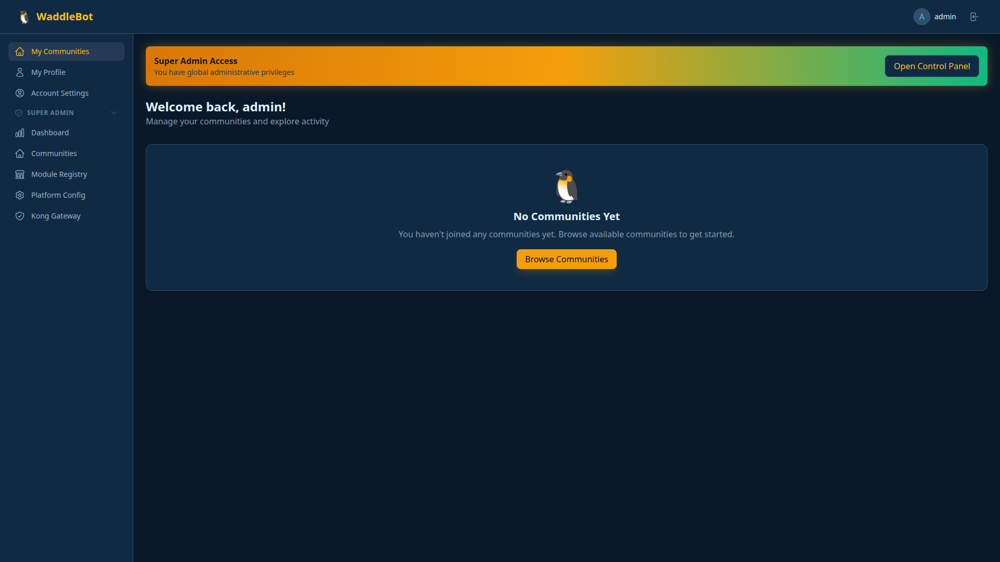
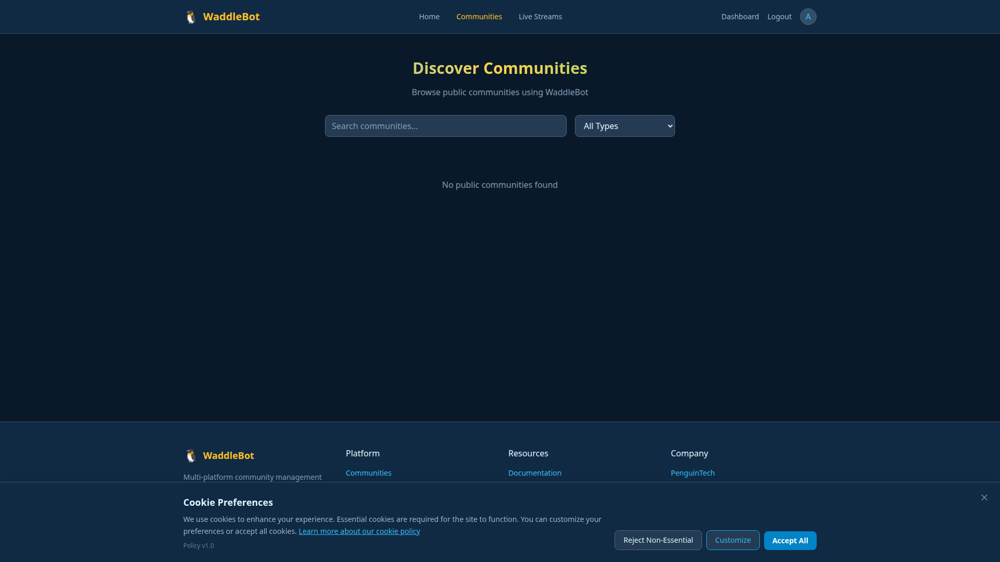
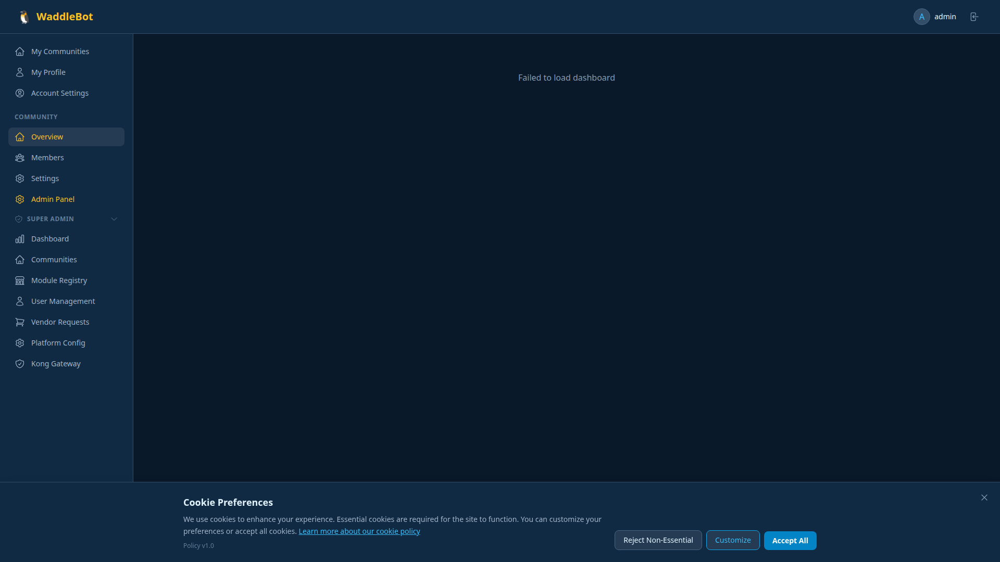
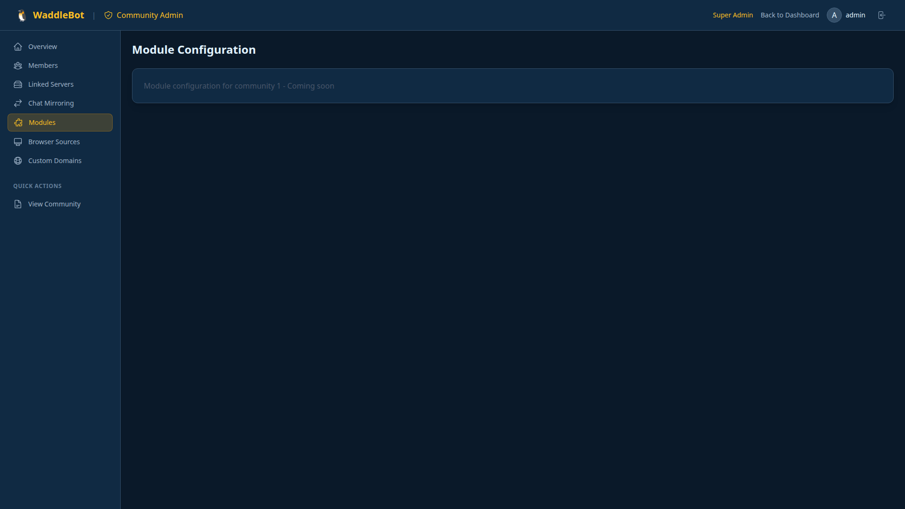
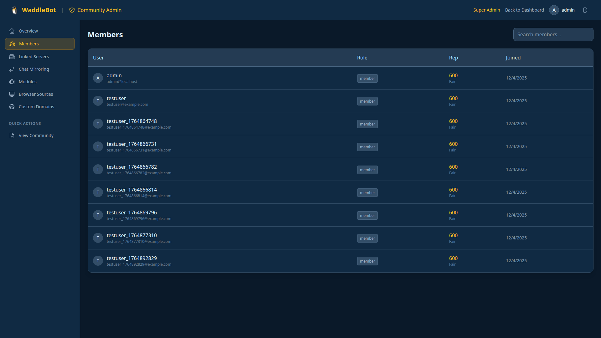

# WaddleBot v0.2.0

> **Next-Generation Multi-Platform Bot Framework**
>
> Build powerful chatbots for Twitch, Discord, Slack, YouTube, and more with AI, loyalty systems, and enterprise-grade deployment options.

[](https://www.gnu.org/licenses/gpl-3.0)
[](https://github.com/waddlebot/waddlebot)
[](https://www.docker.com/)
[](https://kubernetes.io/)

---

## Why WaddleBot?

**For Streamers & Communities:**
- Engage your audience with AI-powered chat, loyalty points, and interactive minigames
- Support multiple platforms from one place (Twitch, Discord, Slack, YouTube)
- Built-in features: giveaways, duels, music requests, event calendars, and more

**For Developers:**
- Modern microservices architecture with clean APIs
- Easy to extend with new modules and commands
- Comprehensive documentation and examples
- Production-ready with Kubernetes and CI/CD

**For Businesses:**
- Enterprise deployment options with high availability
- RBAC, audit logging, and security best practices
- Multi-tenant support for managing multiple communities
- Prometheus metrics and observability built-in

## Quick Start

### Try It Locally (5 minutes)

```bash
git clone https://github.com/waddlebot/waddlebot.git
cd waddlebot
docker-compose up -d
```

**Access the admin portal:** http://localhost:8060
**Default login:** `admin@localhost` / `admin123`

### Deploy to Kubernetes

```bash
cd k8s
helm install waddlebot ./helm/waddlebot -n waddlebot --create-namespace
```

**See [k8s/QUICKSTART.md](k8s/QUICKSTART.md) for full deployment guide.**

## Key Features

### 🎮 Out-of-the-Box Modules

| Feature | Description |
|---------|-------------|
| **AI Chat** | Intelligent responses powered by Ollama, OpenAI, or MCP |
| **Loyalty System** | Virtual currency, earning configs, leaderboards |
| **Minigames** | Slots, coinflip, roulette with betting |
| **Duels** | PvP wagering with gear bonuses |
| **Giveaways** | Reputation-weighted prize system |
| **Music** | Spotify & YouTube Music with OBS integration |
| **Calendar** | Event scheduling with approval workflows |
| **Shoutouts** | Highlight users across platforms |
| **Inventory** | Item management system |
| **Memories** | Community quotes and reminders |

### 🚀 Platform Support

✅ **Twitch** - EventSub webhooks, chat commands, OAuth
✅ **Discord** - Bot events, slash commands
✅ **Slack** - Events API, slash commands
✅ **YouTube Live** - Live chat, SuperChat
✅ **Kick** - Webhook integration

### 🏗️ Architecture

```
Platform Events (Twitch, Discord, Slack, YouTube)
        ↓
    Router Module (Command Processing & API Gateway)
        ↓
Interactive Modules (AI, Loyalty, Music, Games)
        ↓
Core Services (Identity, Reputation, Browser Source)
        ↓
Infrastructure (PostgreSQL, Redis, MinIO, Qdrant)
```

**Full architecture diagram:** [docs/ARCHITECTURE.md](docs/ARCHITECTURE.md)

## Screenshots

### Dashboard Overview


### Community Management



### Module Registry & Command Routing



### User Management


## What's New in v0.2.0

- ✅ **Kubernetes Deployment** - Helm charts, manifests, auto-scaling
- ✅ **GitHub Actions CI/CD** - Automated builds and deployments
- ✅ **Health Check Standardization** - `/health`, `/healthz`, `/metrics` on all containers
- ✅ **Loyalty System** - Complete virtual economy with minigames and duels
- ✅ **Comprehensive Docs** - Architecture, API reference, deployment guides

**Full changelog:** [CHANGELOG.md](CHANGELOG.md)

## Documentation

| Guide | Description |
|-------|-------------|
| **[Getting Started](docs/deployment-guide.md)** | Installation and first-time setup |
| **[Architecture](docs/ARCHITECTURE.md)** | System design and component overview |
| **[API Reference](docs/api-reference.md)** | Complete API documentation |
| **[Kubernetes](k8s/README.md)** | K8s deployment, Helm, CI/CD |
| **[Development](docs/development-rules.md)** | Building new modules |
| **[Module Details](docs/module-details-core.md)** | In-depth module documentation |

**Browse all docs:** [/docs](docs/)

## Technology Stack

**Backend:** Python 3.13, Flask/Quart, PostgreSQL, Redis
**Frontend:** React 18, Vite, TailwindCSS
**Infrastructure:** Docker, Kubernetes, Helm v3, GitHub Actions
**AI/LLM:** Ollama, OpenAI, MCP providers
**Storage:** PostgreSQL, MinIO (S3), Qdrant (vectors)

## License

**Open Source (GPL-3.0)** - Free for personal, internal, and educational use

**Commercial License** required for:
- SaaS/hosting services
- Commercial products embedding WaddleBot
- Managed services for clients

**Contributor Employer Exception:** Companies employing contributors get perpetual GPL-2.0 access to versions their employee contributed to.

**Contact:** licensing@waddlebot.com

## Community & Support

- **Documentation:** [/docs](docs/)
- **Issues:** [GitHub Issues](https://github.com/waddlebot/waddlebot/issues)
- **Discord:** Coming soon
- **Email:** support@waddlebot.com

## Contributing

We welcome contributions! See [docs/development-rules.md](docs/development-rules.md) for guidelines.

---

**Made with ❤️ by the WaddleBot team**

*Want to see WaddleBot in action? [Schedule a demo](mailto:demo@waddlebot.com)*
