# Waddles

> **Multi-platform community & bot platform — App Bundle marketplace on an ingest → process → action → presentation pipeline.**
>
> Twitch, Discord, Slack, YouTube, Kick, Teams, Mattermost, and Google Chat in one platform, extended by an App Bundle marketplace instead of hand-wired modules.

[](https://www.gnu.org/licenses/gpl-3.0)
[-orange.svg)](docs/ARCHITECTURE.md)
[](https://kubernetes.io/)

---

## What is Waddles?

Waddles is a chat bot and community platform built around the **SCCEBM** module set —
**S**ocials, **C**ustomer, **C**ommunity, **E**vent, **B**ot, **M**arketing.
Every capability, first-party or third-party, ships as an **App Bundle**: a versioned package of
per-stage scripts (`ingest` / `process` / `action` / `presentation`) that a tenant installs,
makes available, and a community activates. The platform provides the pipeline, identity,
entitlement, and marketplace; App Bundles provide the behavior.

v3.0.x is a from-the-ground-up re-architecture of the v2.2.x monolith-of-microservices into a
fixed 8-container pipeline, still in **alpha** on `release/v3.0.X`. See [Build status](#build-status--what-is-real-today)
for exactly what's real vs. scaffolded.

## Architecture: 8 containers

```
 inbound                                                              outbound
   │                                                                     ▲
   ▼        ┌───────────────┐    ┌───────────────┐    ┌───────────────┐ │
 svc-ingest │ Valkey stream │ svc-process │ Valkey │  svc-action  │─────┘
   │  ────▶ └───────────────┘  ────▶       ────▶   └──────┬────────┘
   │                                                       │ overlay target
   │                                                ┌──────▼─────────┐
   │                                                │ svc-presentation │ overlays + Music Station
   │                                                └──────────────────┘ (OBS browser sources)
   │        ┌───────────────┐
   └───────▶│ svc-streaming │ RTC + HLS/RTMP/AV1 record/forward/transcode
            └───────────────┘

  svc-core   identity · security · credentials · entitlement (RustLang, gRPC :50203, every stage depends on it)
  hub-api    admin + tenancy + marketplace + billing + gRPC/REST/MCP  (Python/Quart control plane)
  hub-webui  ExpressScript + ReactJS (static-serve/proxy)
```

| Container | Carries | Language | Port |
|---|---|---|---|
| `svc-ingest` | Platform receivers + inbound webhooks (Twitch, Slack, Discord, Kick, YouTube + generic intake) | RustLang | 8200 |
| `svc-process` | Event bus, routing, command dispatch, workflow; orchestrates `process`-stage WASM components | RustLang | 8201 |
| `svc-action` | Outbound actions/interactions/3rd-party calls; orchestrates `action`-stage WASM components + target adapters | RustLang | 8202 |
| `svc-core` | Identity, security, credentials, entitlement — called synchronously by every other stage | RustLang, gRPC | 8203 / grpc 50203 |
| `hub-api` | Admin, tenancy, marketplace, billing, AI routing control plane + gRPC + REST + MCP | Python/Quart | 8204 / grpc 50204 |
| `hub-webui` | SPA assets, static-serve + `/api` proxy for the ReactJS webui | ExpressScript + ReactJS | 8205 |
| `svc-presentation` | Core overlays (`full_screen`/`media`/`crawler`) + Music Station + bundles' `presentation` component | RustLang | 8207 |
| `svc-streaming` | RTC + HLS/RTMP/AV1 record/forward/transcode control plane | RustLang | 8208 / grpc 50208 |

A ninth container, `svc-rtc` (Go, WebRTC/SFU), still runs standalone and is the planned absorption
target into `svc-streaming` — not yet merged.

The Data Plane services (`svc-*`) communicate over per-`(tenant, community, workstream, stage)` **Valkey Streams** (`XADD`, `XREADGROUP`, `XAUTOCLAIM`). TLS encryption and authentication are enabled by default for PostgreSQL and Valkey in every environment (`security.transport.tls` / `security.transport.auth`).

Messages crossing stage boundaries are typed JSON envelopes (`PlatformEvent`, `StageEnvelope`) carrying cryptographically signed MAC workstream bindings (`binding.mac`) to enforce zero-trust tenant boundary isolation.

## App Bundle model

```
Core → Module → Feature → App (Bundle)
```

- **Core** — mandatory, non-toggleable platform: identity, tenancy, entitlement, marketplace, event bus.
- **Module** — one of the SCCEBM modules (+ Streaming), globally toggleable via Helm.
- **Feature** — a capability inside a module (`waddles.community.chat`, `waddles.streaming.music_station`).
- **App (Bundle)** — the code implementing a Feature. A bundle **is** the App, not a group of Apps:
  `bundle.yaml` manifest + a `{config, spec, script}` directory per stage it implements (`process`/`action`, optionally `presentation`).
- **gVisor + WASM Sandbox Runtime** — all App Bundles (first-party and third-party) execute as **WASI 0.2 WebAssembly components** inside a credential-less executor (`bundle-executor`) running under a **gVisor `RuntimeClass` (`runsc`)** for complete multi-tenant isolation, memory safety, and capability-scoped egress.
- **Multi-Language Support** — Python, Rust, and JavaScript/TypeScript (Tier 1) are compiled via gVisor-sandboxed build Jobs (e.g. `componentize-py` for Python with `penguin-dal`). Any WASI 0.2 component implementing the WIT world is accepted prebuilt (Tier 2). `ingest` is fixed Rust code and not bundle-pluggable.

**3-tier lifecycle**, strict subset invariant `activated ⊆ available ⊆ installed`:

| Tier | Scope | Table |
|---|---|---|
| Installed | Global/platform | `app_catalog` |
| Available | Tenant | `app_tenant_availability` |
| Activated | Community (a **set**, not one winner) | `app_activations` |

A community can run several bundles side by side for the same Feature (`resolve_apps`, not the old
single-winner `resolve_app`) — e.g. 4 giveaway bundles running independently. Conflicts are
declared explicitly via `incompatible_with` (symmetric; blocks co-activation) rather than picked by
narrowest-scope-wins.

**Distribution**: hub-api is the sole writer to `app_catalog` (control plane, primary DB). Each
stage-runner **polls** hub-api for its stage's installed set and reconciles locally — a restarting
or newly-scaled replica self-heals on its first poll. Per-event routing reads go to a **read
replica**, never hub-api or the primary, so the admin API never sits on the event hot path.

**Standardized action targets** — every `action` stage bundle declares one `target_type`, and the
platform provides one adapter per type: `webhook` | `rest_api` | `grpc_api` | `graphql_api` |
`email` | `overlay` | `message_queue`. `overlay` fans out to `svc-presentation`'s three surfaces:
`full_screen` | `media` | `crawler`.

Full spec: [`docs/plans/2026-08-31-app-bundle-sdk-design.md`](docs/plans/2026-08-31-app-bundle-sdk-design.md).
Container/module mapping detail: [`docs/ARCHITECTURE.md`](docs/ARCHITECTURE.md).

## SCCEBM modules

| # | Module | Scope |
|---|---|---|
| S | **Socials** | External social-media management — posts/responses/analytics for LinkedIn, X, Facebook, Instagram, TikTok |
| C | **Customers** | CRM — accounts, contacts, opportunities, cases |
| C | **Community** | Internal engagement — forum, chat, polls, announcements, raffles |
| E | **Event** | Event/conference management — calendar, ticketing |
| M | **Marketing** | Campaigns, shortlinking, emailing |
| B | **Bot** | Multi-platform bot — commands, connectors, interactions (wraps v2.2.x's feature set) |
| S | **Streaming** | `svc-streaming` container + hub-api control plane — stream/calls/overlay/Music Station |

The **community entity** (teams/OUs) is Core infrastructure, not the Community module — module
toggles turn off *behavior*, never the tenancy hierarchy itself.

## Feature flags & licensing

Two-gate model, AND'd together — a feature is available only if **both** are true:

```
MODULE global toggle (Helm: modules.<name>.enabled)
        │
PER-CAPABILITY PostHog flag  waddles.{module}.{feature}   (new flags default OFF)
        │
TIER gate (license entitlement: free / professional / enterprise)
```

Unreachable license/flag server degrades to last-known cache — never fails open on a flag it has
never seen. Entitlement resolves narrowest-first: community → tenant.

| Tier | Sizing | Gated features |
|---|---|---|
| Free | ≤50 employees, 1 admin, 1 tenant | Core product |
| Professional | 50–200 employees | Whitelabelling, Google OAuth2 SSO, unlimited workflows/admins |
| Enterprise | 200+ employees or 10+ years, many tenants | SAML 2.0/OIDC SSO, audit & compliance, advanced analytics, WaddleAI |

## Hero features

- **App Bundle marketplace** — install/available/activate lifecycle in hub-api, vendor
  submission + review, discount codes, per-vendor analytics.
- **Music Station** — one per-community queue mixing YouTube and Spotify (SoundCloud planned),
  fed by song requests and imported playlists, normalized to a common `Track` model. The player,
  overlay, and live SSE push to OBS browser sources are real; per-source ingest bundles and
  moderation tooling are still landing.
- **Presentation & overlays** — `full_screen` / `media` / `crawler` overlay surfaces plus any
  bundle's own `presentation` component, served per-community by `svc-presentation` for OBS.
- **Streaming proxy control plane** — record / display / forward-to-N-targets / transcode / RTC,
  fronting external transcode and SFU engines today; native Rust data plane is a planned migration,
  not yet built.
- **Premium AI routing** — free-local model → premium local model (metered) → BYOK (your own
  OpenAI/Anthropic/etc. key, proxied server-side, never client-side). Lives in
  `hub_api/services/ai_routing/`.
- **Metered token billing** — one ledger mechanism for two consumables today: streaming
  transcode tokens and premium-AI tokens. Global admin sets pricing; communities buy a balance
  that usage decrements. Lives in `hub_api/services/token_billing_service.py` /
  `token_ledger.py`.

## Build status — what is real today

v3.0.x is mid-migration. Read this before assuming a container is production-ready:

| Container | App code | Dockerfile | Helm chart wiring |
|---|---|---|---|
| `svc-ingest`, `svc-process`, `svc-action`, `svc-presentation`, `svc-streaming`, `hub-api`, `hub-webui` | Real, tested | Real, per-container | **Still pinned to a shared placeholder base image** — no CI-built per-container image yet |
| `svc-core` | Not consolidated — identity/security/credentials still live as separate module services (`core/identity_core_module`, `core/security_core_module`, `core/credential_manager_module`) | Skeleton | Skeleton |

The 8-container Helm templates **coexist** with ~31 legacy per-module Deployments from v2.2.x
(router, collectors, action-platforms, etc.) — the legacy set still carries most live traffic
during cutover. Nothing is deleted; see
[`k8s/helm/waddlebot/PIPELINE_MAPPING.md`](k8s/helm/waddlebot/PIPELINE_MAPPING.md) for the full
31→8 mapping and what's left.

## Quick Start

```bash
git clone https://github.com/penguintechinc/waddlebot.git
cd waddlebot

# Local/alpha (MicroK8s or Docker Desktop)
helm install waddlebot ./k8s/helm/waddlebot -n waddlebot --create-namespace \
  -f k8s/helm/waddlebot/values-alpha.yaml

# Beta
helm install waddlebot ./k8s/helm/waddlebot -n waddlebot --create-namespace \
  -f k8s/helm/waddlebot/values-beta.yaml
```

**See [docs/QUICKSTART.md](docs/QUICKSTART.md) for the full deployment and first-run guide.**

### Access the Admin Portal

- **Alpha:** `https://waddles.localhost.local`
- **Beta:** `https://waddlebot.penguintech.cloud`
- **Production:** `https://waddles.app`

## Screenshots

> Regenerate with `node scripts/capture-screenshots.cjs` (requires hub backend + frontend running).

### User Dashboard
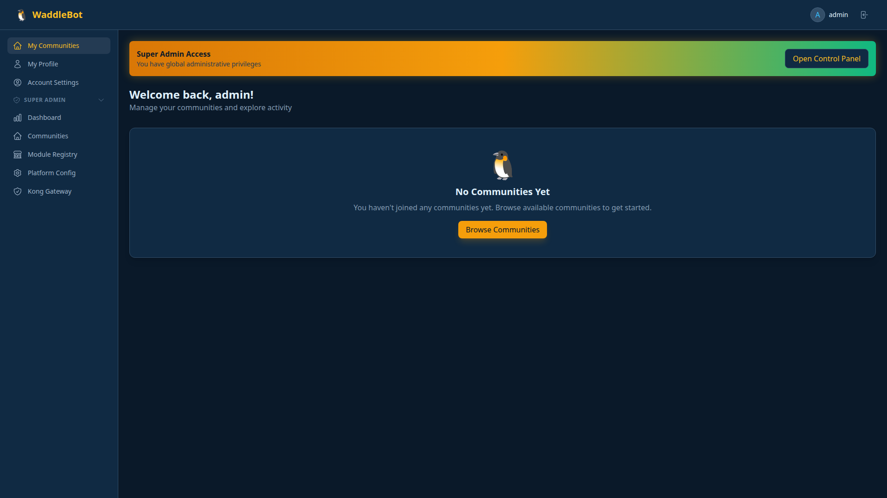
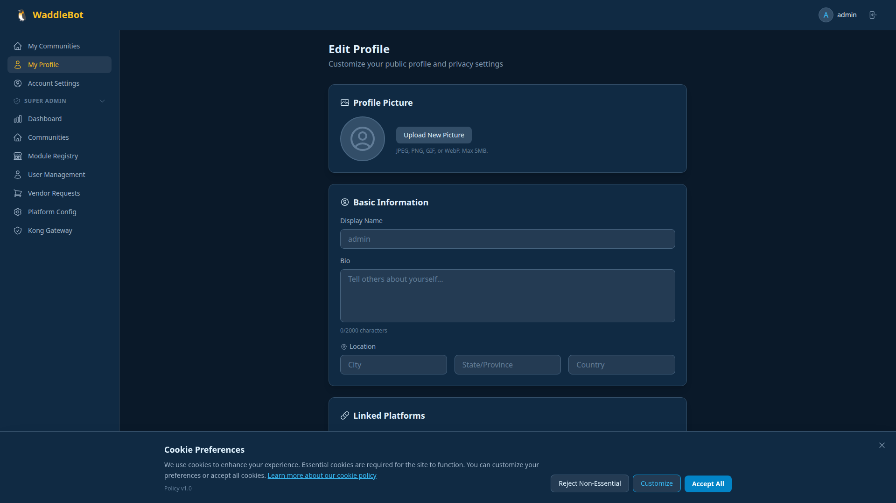
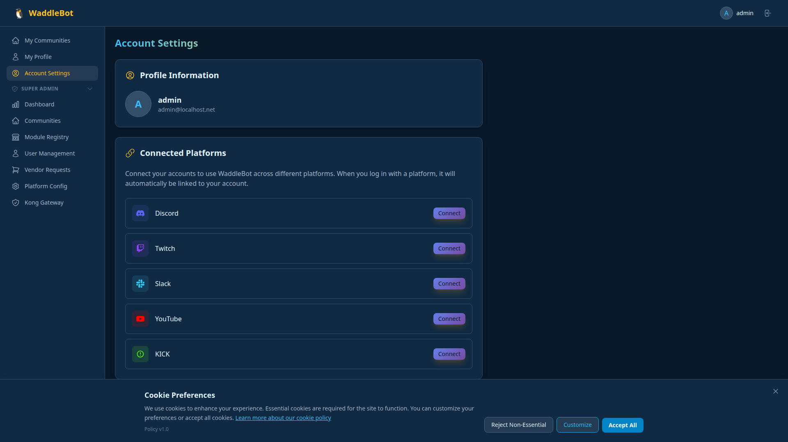

### Community Portal
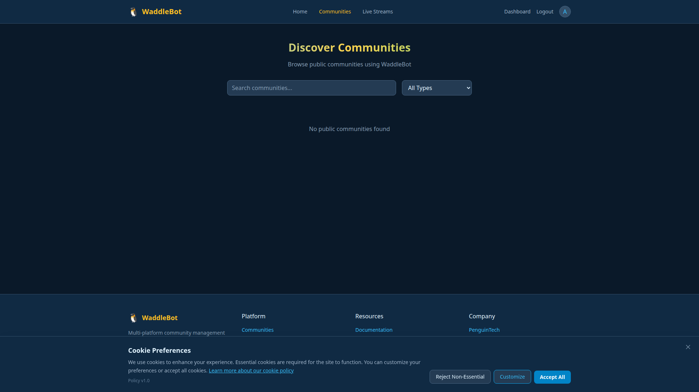
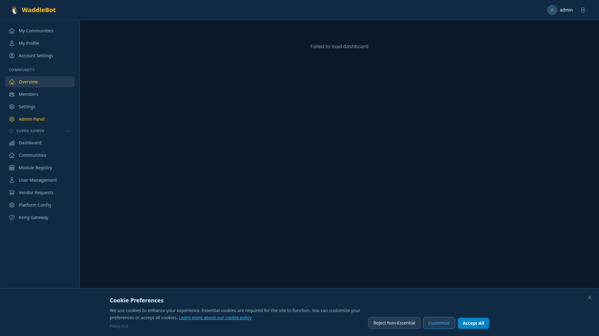
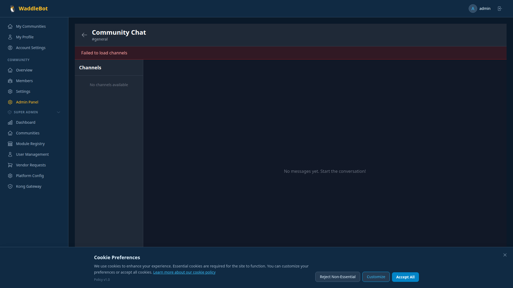
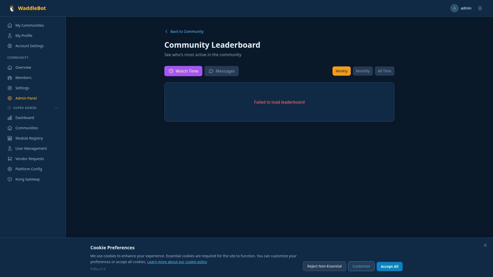
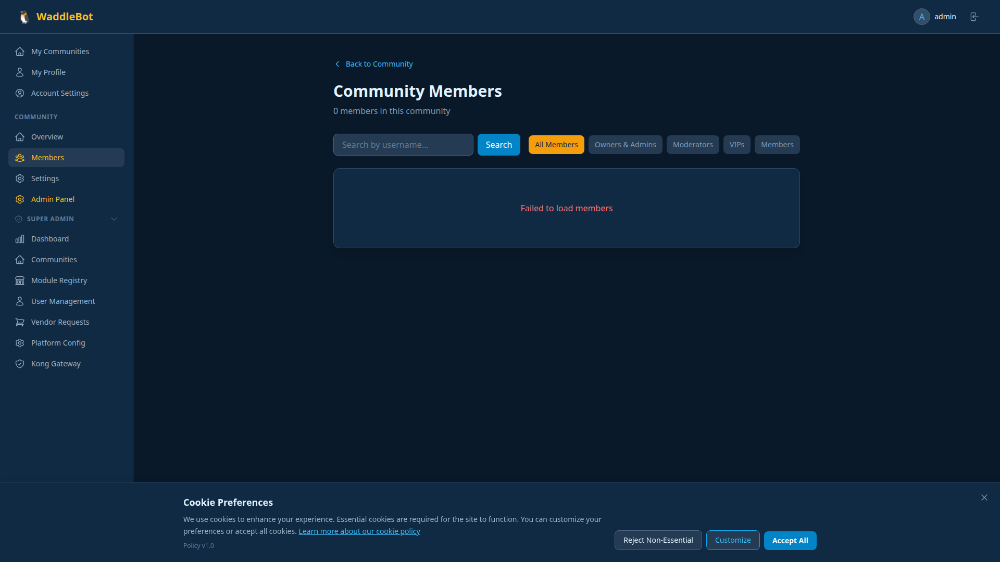
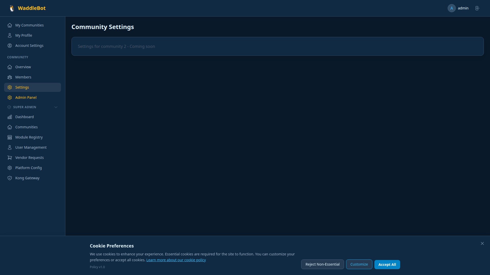

### Admin Panel
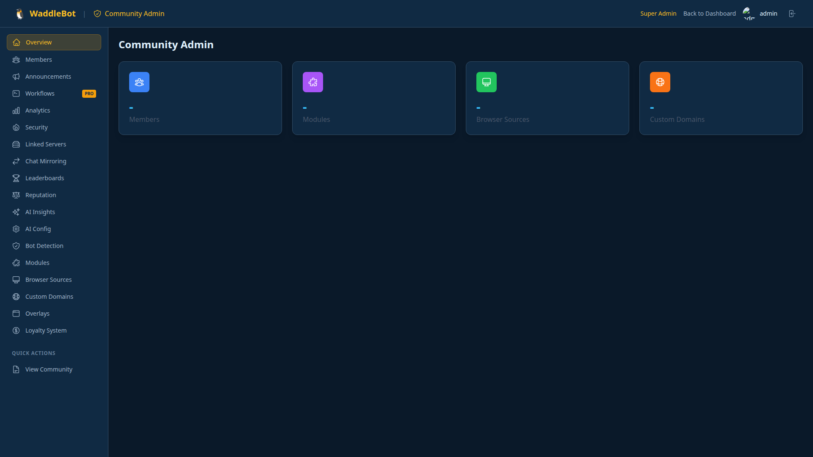
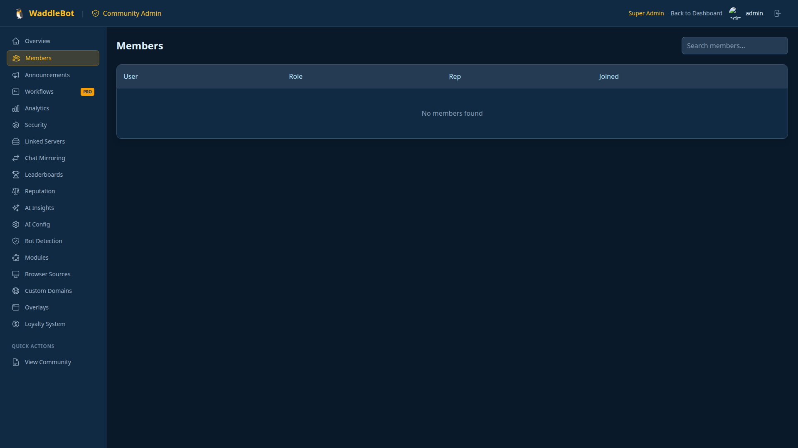
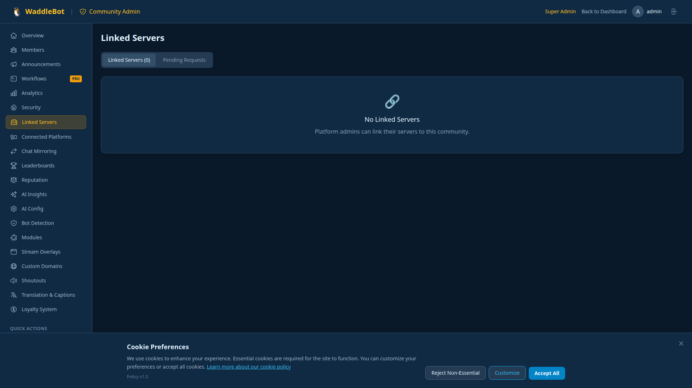
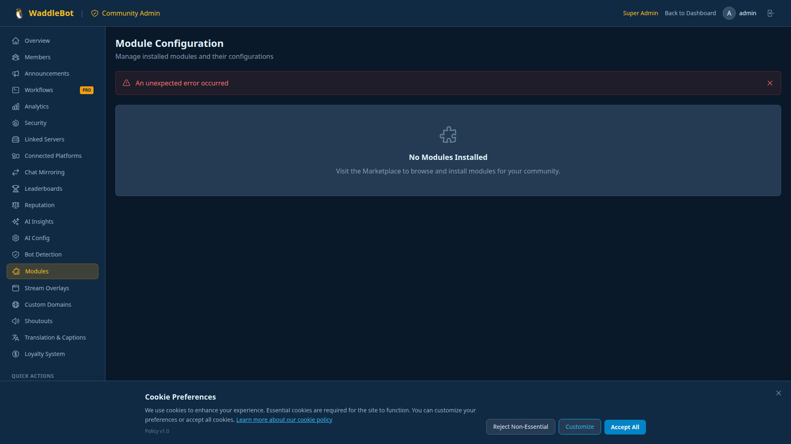
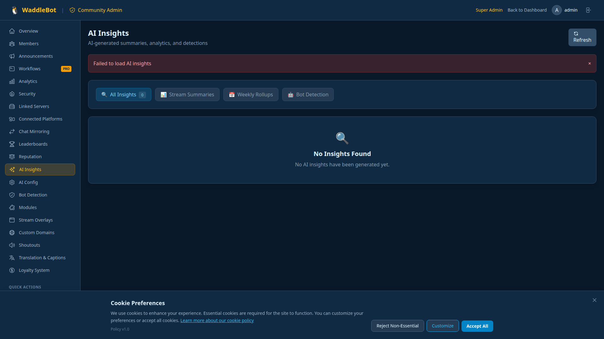
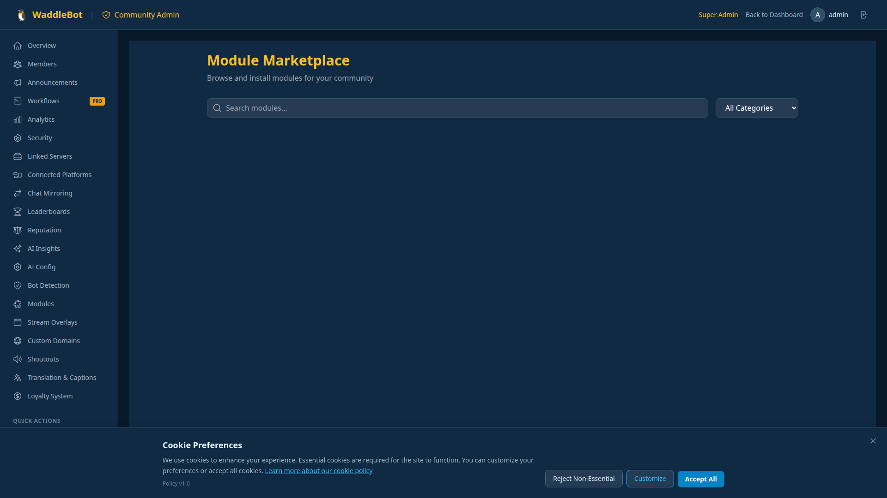
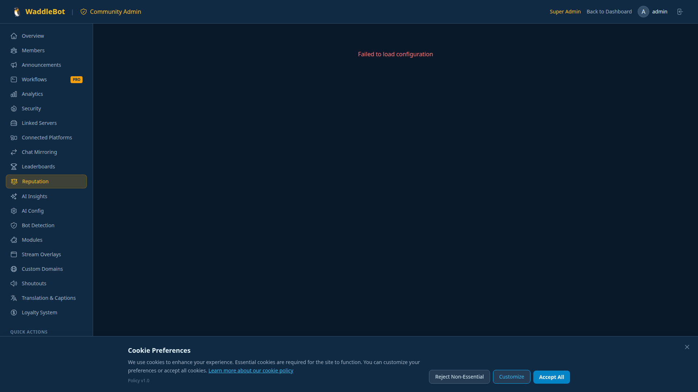

### Super Admin
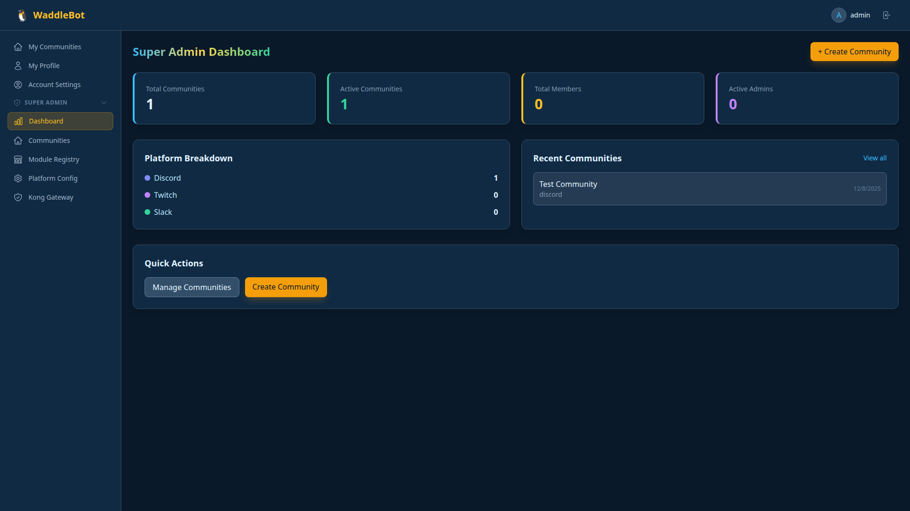
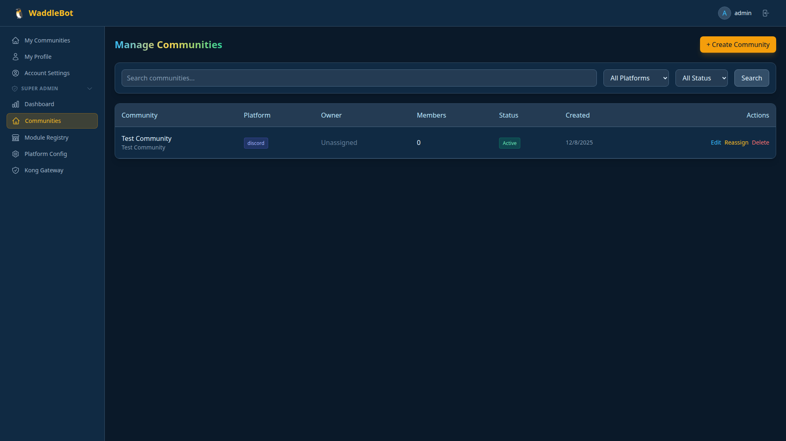

## Documentation

| Guide | Description |
|-------|-------------|
| **[Architecture](docs/ARCHITECTURE.md)** | 8-container pipeline, App Bundle model, module ownership |
| **[Quick Start](docs/QUICKSTART.md)** | Helm deployment and first-time setup |
| **[App Bundle SDK](docs/plans/2026-08-31-app-bundle-sdk-design.md)** | Bundle authoring spec — manifest, stages, lifecycle, distribution |
| **[Kubernetes](docs/KUBERNETES.md)** | Helm chart reference |
| **[Database](docs/DATABASE.md)** | Schema, migrations, per-service accounts |
| **[Contributing](docs/CONTRIBUTING.md)** | Building new App Bundles and contributing |
| **[Security](docs/SECURITY.md)** | Security policy and reporting |
| **[Changelog](CHANGELOG.md)** | Version history |

**Browse all docs:** [/docs](docs/)

## Technology Stack

**Data Plane (`svc-*`):** RustLang (Axum, tokio, SeaORM, gRPC, OTel)
**Control Plane (`hub-api`):** Python 3.13, Quart (async)
**Web UI (`hub-webui`):** ExpressScript + ReactJS (React 18), Vite, TailwindCSS v4
**App Bundle Runtime:** Sandboxed WASI 0.2 WASM components in gVisor (`runsc`)
**Pipeline Spine:** Valkey Streams (TLS + ACL authenticated)
**Storage & Infrastructure:** PostgreSQL, Valkey, MinIO (S3), Qdrant (vectors), Docker, Kubernetes (Helm v3)

## License

**Open Source (GPL-3.0)** — free for personal, internal, and educational use.

**Commercial License** required for:
- SaaS/hosting services
- Commercial products embedding Waddles
- Managed services for clients

**Contributor Employer Exception:** companies employing contributors get perpetual GPL-2.0 access
to versions their employee contributed to.

See [LICENSE.md](LICENSE.md) for full terms.

## Community & Support

- **Documentation:** [/docs](docs/)
- **Issues:** [GitHub Issues](https://github.com/penguintechinc/waddlebot/issues)
- **Company:** [www.penguintech.io](https://www.penguintech.io)
- **Email:** support@penguintech.io

## Contributing

We welcome contributions! See [docs/CONTRIBUTING.md](docs/CONTRIBUTING.md) for guidelines.

---

**Made with care by [Penguin Tech Inc](https://www.penguintech.io)**
