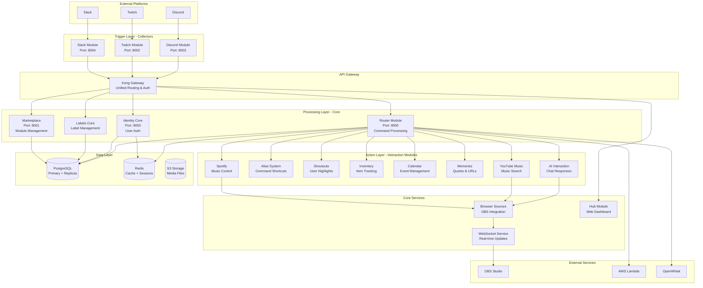
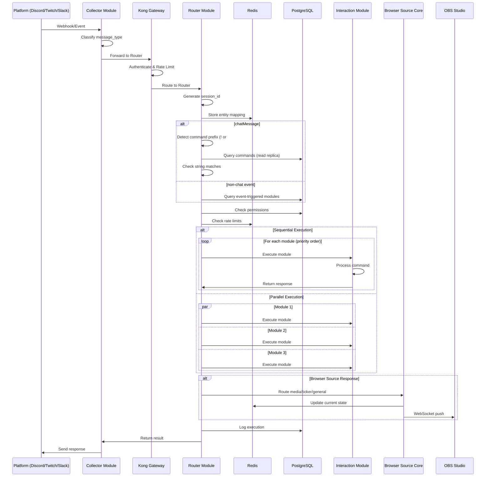
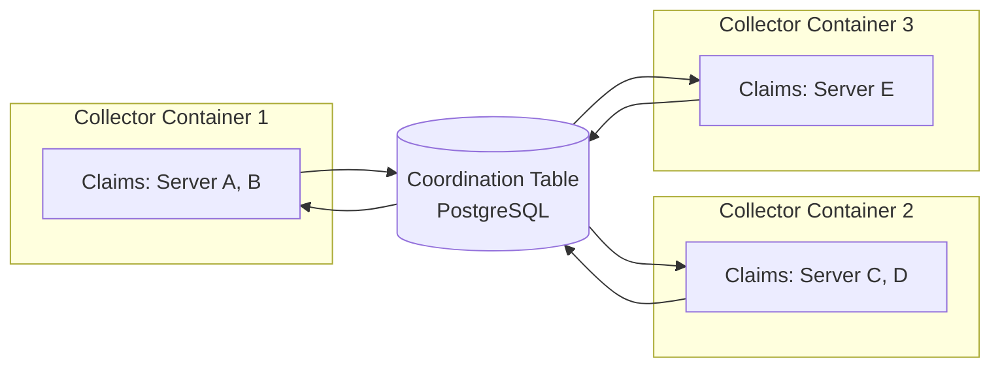

# WaddleBot System Architecture

**Version:** 1.0
**Last Updated:** 2025-12-16

## Table of Contents

- [System Overview](#system-overview)
- [Design Principles](#design-principles)
- [Module Categories](#module-categories)
- [Communication Patterns](#communication-patterns)
- [Database Architecture](#database-architecture)
- [Redis Architecture](#redis-architecture)
- [Event Processing Flow](#event-processing-flow)
- [High-Performance Features](#high-performance-features)
- [Security & Authentication](#security--authentication)
- [Horizontal Scaling](#horizontal-scaling)
- [Technology Stack](#technology-stack)

---

## System Overview

WaddleBot is a microservices-based chatbot platform that enables communities to interact with their members across Discord, Twitch, and Slack. The system uses event-driven architecture with a central router processing commands and coordinating between platform-specific collectors and feature-specific interaction modules.

### Architecture Diagram



### System Components

| Component | Purpose | Technology | Port |
|-----------|---------|------------|------|
| **Collectors** | Platform event ingestion | py4web, platform SDKs | 8002-8004 |
| **Router** | Command processing & routing | py4web, Quart (async) | 8000 |
| **Marketplace** | Module management | py4web | 8001 |
| **Identity Core** | User authentication | py4web + Auth | 8050 |
| **Interaction Modules** | Feature implementation | py4web, platform APIs | Various |
| **Browser Sources** | OBS overlay integration | Flask, WebSocket | 8080 |
| **Hub Module** | Web dashboard | Flask, Flask-Security | 8090 |

---

## Design Principles

### Microservices Architecture

Each component runs as an independent service with well-defined APIs:

- **Trigger Modules**: Platform-specific message and event collection (Discord, Twitch, Slack)
- **Processing Layer**: Central business logic and command routing (Router, Marketplace)
- **Action Modules**: Feature-specific functionality (AI, Music, Calendar, etc.)
- **Core Services**: Shared infrastructure (Identity, Labels, Browser Sources)
- **Admin Tools**: Management and monitoring interfaces (Hub Module)

### Event-Driven Communication

Components communicate through multiple protocols:

- **REST APIs**: Kong API Gateway with unified routing and authentication
- **Message Events**: Platform events processed through router with session tracking
- **WebSocket**: Real-time updates for browser sources and live data
- **Database**: Shared state via PostgreSQL with read replicas for performance

### Horizontal Scalability

Built for scale from day one:

- **Container-based**: Docker containers with Kubernetes orchestration
- **Database Scaling**: PostgreSQL with read replicas and connection pooling
- **Caching Layer**: Redis with namespace separation for different use cases
- **Load Balancing**: Kong API Gateway with rate limiting and traffic management
- **Dynamic Assignment**: Coordination system for distributing workload across containers

---

## Module Categories

### Trigger Modules (Collectors)

Platform-specific event collection modules that receive events from external platforms.

| Platform | Module | Port | Event Types |
|----------|--------|------|-------------|
| **Discord** | discord_module | 8003 | Messages, reactions, joins, boosts, voice |
| **Twitch** | twitch_module | 8002 | Chat, subs, follows, raids, bits, stream events |
| **Slack** | slack_module | 8004 | Messages, reactions, joins, file shares |

**Key Features:**
- Platform SDK integration (py-cord, TwitchIO, slack-sdk)
- Webhook/EventSub receivers
- Event classification and normalization
- Router forwarding with session tracking

### Processing Modules (Core)

Central processing layer handling command routing and business logic.

| Module | Purpose | Key Features |
|--------|---------|--------------|
| **Router** | Command processing & routing | Multi-threading, rate limiting, caching, string matching |
| **Marketplace** | Module management | Installation, versioning, subscriptions, router sync |
| **Identity Core** | User authentication | Cross-platform linking, verification, API keys |
| **Labels Core** | Community/user labeling | Tag management, label assignment, filtering |

**Key Features:**
- High-performance processing with ThreadPoolExecutor
- Read replica support for database queries
- Redis caching with TTL-based invalidation
- Comprehensive permission checking

### Action Modules (Interaction)

Feature-specific modules that provide functionality to users.

| Module | Purpose | Dependencies |
|--------|---------|--------------|
| **AI Interaction** | Chat responses with AI | Ollama/OpenAI/MCP |
| **Alias System** | Linux-style command aliases | Router |
| **Shoutouts** | User highlights with clips | Twitch API |
| **Inventory** | Item tracking & checkout | Labels Core |
| **Calendar** | Event management | Labels Core |
| **Memories** | Quotes, URLs, reminders | Labels Core |
| **YouTube Music** | Music search & display | YouTube API |
| **Spotify** | Music control & display | Spotify API |

**Key Features:**
- Per-entity configuration and permissions
- Multiple response types (chat, media, ticker, general)
- Browser source integration for OBS
- Session-based response tracking

### Core Services

Supporting infrastructure for advanced features.

| Service | Purpose | Used By |
|---------|---------|---------|
| **Browser Sources** | OBS overlay integration | Music modules, general responses |
| **WebSocket Service** | Real-time updates | Browser sources, live data |
| **Hub Module** | Web dashboard | Community management, admin tasks |

---

## Communication Patterns

### REST API (Primary)

**Kong API Gateway** provides unified routing:

```
Platform → Collector → Kong → Router → Interaction Module
```

- **Authentication**: Kong API Keys per service
- **Rate Limiting**: Kong plugins with per-route limits
- **Load Balancing**: Automatic load distribution
- **Service Discovery**: Kong's service registry

**Example Request Flow:**
```json
POST /api/router/process
Headers:
  X-Kong-Service-Name: twitch_module
  Authorization: Bearer {API_KEY}
Body:
  {
    "message_type": "chatMessage",
    "entity_id": "twitch:channel:waddlebot",
    "user_id": "123456",
    "message": "!help",
    "session_id": "sess_abc123"
  }
```

### gRPC (Future)

Planned for high-performance module communication:

- **Protocol Buffers**: Strongly-typed message schemas
- **Streaming**: Bidirectional streaming for real-time data
- **Performance**: Lower latency than REST for module-to-module calls

### WebSocket (Real-time)

Browser Source Core uses WebSocket for live updates:

```
Interaction Module → Router → Browser Source Core → WebSocket → OBS
```

**Connection Types:**
- **Ticker Stream**: Scrolling text notifications
- **Media Stream**: Music/video display with metadata
- **General Stream**: HTML content, forms, alerts

**Authentication:**
- Token-based URLs: `wss://browser.waddlebot.com/{token}/ticker`
- Per-community tokens for security
- Read-only connections (no upstream messages)

---

## Database Architecture

### PostgreSQL (Primary Database)

**Configuration:**
- Primary database for writes
- Read replicas for high-frequency queries (command lookups, permissions)
- Connection pooling with ThreadPoolExecutor
- Per-module table separation

### Core Shared Tables

#### Servers Table
Tracks monitored platform channels across all collectors:

```sql
servers (
    id,
    owner,
    platform,           -- 'twitch', 'discord', 'slack'
    channel,
    server_id,
    is_active,
    webhook_url,
    config,             -- JSON configuration
    last_activity,
    created_at,
    updated_at
)
```

#### Entities Table
Maps platform identifiers to WaddleBot entities:

```sql
entities (
    id,
    entity_id,          -- Unique WaddleBot entity identifier
    platform,           -- 'twitch', 'discord', 'slack'
    server_id,          -- Platform server/guild ID
    channel_id,         -- Platform channel ID
    owner,              -- Owner user ID
    is_active,
    config              -- JSON configuration
)
```

### Router Tables

#### Commands Table
Command registration and routing:

```sql
commands (
    id,
    command,            -- Command name (e.g., 'help', 'stats')
    prefix,             -- '!' for local, '#' for community
    description,
    location_url,       -- Module endpoint URL
    location,           -- 'internal' for !, 'community' for #
    type,               -- 'container', 'lambda', 'openwhisk', 'webhook'
    method,             -- HTTP method
    timeout,            -- Request timeout
    auth_required,
    rate_limit,         -- Requests per minute
    is_active,
    module_type,        -- 'trigger', 'action', 'core'
    trigger_type,       -- 'command', 'event', 'both'
    event_types,        -- JSON array of event types
    priority,           -- Lower = higher priority
    execution_mode      -- 'sequential', 'parallel'
)
```

#### Command Executions Table
Audit log for all command executions:

```sql
command_executions (
    id,
    execution_id,       -- Unique execution identifier
    command_id,
    entity_id,
    user_id,
    message_content,
    parameters,         -- JSON parsed parameters
    location_url,
    request_payload,    -- JSON request
    response_status,    -- HTTP status code
    response_data,      -- JSON response
    execution_time_ms,
    error_message,
    retry_count,
    status              -- 'pending', 'success', 'failed'
)
```

#### Coordination Table
Dynamic server/channel assignment for horizontal scaling:

```sql
coordination (
    id,
    platform,
    server_id,
    channel_id,
    entity_id,
    claimed_by,         -- Container ID that claimed this entity
    claimed_at,
    status,             -- 'available', 'claimed', 'offline', 'error'
    is_live,            -- Live stream status
    viewer_count,
    last_activity,
    claim_expires,
    heartbeat_interval,
    priority,
    created_at,
    updated_at
)
```

### Module-Specific Tables

Each interaction module has dedicated tables for data isolation:

- **Memories**: memories, reminders, memory_reactions, memory_categories
- **Calendar**: events, event_attendees, event_reminders
- **Inventory**: inventory_items, inventory_activity
- **YouTube Music**: youtube_now_playing, youtube_search_cache, youtube_activity
- **Spotify**: spotify_tokens, spotify_now_playing, spotify_search_cache

### Database Optimization

**Indexing:**
- Primary keys on all `id` columns
- Foreign key indexes for joins
- Composite indexes on (community_id, entity_id, user_id)
- Index on `is_active` flags

**Connection Pooling:**
- Separate pools for read and write operations
- ThreadPoolExecutor for concurrent operations
- Configurable pool sizes based on load

**Caching:**
- Redis caching for frequently accessed data
- TTL-based cache invalidation
- Thread-safe local caching with fallback

---

## Redis Architecture

### Database Separation Strategy

WaddleBot uses Redis with namespace separation and database allocation:

```
DB 0: Caching & Sessions
  - General application cache
  - Session storage
  - Eviction: allkeys-lru

DB 1: Rate Limiting
  - Rate limit counters (sorted sets)
  - Cooldown tracking
  - Eviction: volatile-ttl

DB 2: Message Queues
  - Redis Streams
  - Dead letter queues
  - Eviction: noeviction (prevent data loss)

DB 3-15: Reserved for future use
```

### Namespace Strategy

All keys follow consistent naming:

```
{product}:{use_case}:{module}:{entity}:{identifier}

Examples:
waddlebot:cache:router:commands:all
waddlebot:rate_limit:router:user_123:!help
waddlebot:session:router:sess_abc123
waddlebot:stream:events
```

### Use Cases

#### 1. Caching (CacheManager)
- **Namespace**: `waddlebot:cache:{module_name}:`
- **Redis DB**: 0
- **TTL**: 30s - 7200s (data type dependent)
- **Examples**:
  - Command definitions: 300s
  - Entity permissions: 600s
  - User balances: 30-60s
  - Leaderboards: 60-300s

#### 2. Rate Limiting (RateLimiter)
- **Namespace**: `waddlebot:rate_limit:{module_name}:`
- **Redis DB**: 1
- **Data Structure**: Sorted Sets (ZSET) for sliding window
- **TTL**: Equal to window duration
- **Examples**:
  - `waddlebot:rate_limit:router:user_123:!help`
  - `waddlebot:rate_limit:router:cooldown:user_456:!dice`

#### 3. Message Queue (MessageQueue)
- **Namespace**: `waddlebot:stream:{stream_name}`
- **Redis DB**: 2
- **Data Structure**: Redis Streams (XADD/XREADGROUP)
- **Persistence**: AOF (append-only file) enabled
- **Examples**:
  - `waddlebot:stream:events` - Main event stream
  - `waddlebot:dlq:events` - Dead letter queue

#### 4. Session Management
- **Namespace**: `waddlebot:session:{module_name}:`
- **Redis DB**: 0 (shares with cache)
- **TTL**: 3600s (1 hour)
- **Examples**:
  - `waddlebot:session:router:sess_abc123`

### Redis Configuration

```yaml
redis:
  image: redis:7-alpine
  command: >
    redis-server
    --requirepass ${REDIS_PASSWORD}
    --appendonly yes
    --maxmemory 512mb
    --maxmemory-policy allkeys-lru
    --databases 16
```

---

## Event Processing Flow

### Complete Processing Pipeline



### Event Processing Steps

1. **Message Reception**: Collector receives webhook/event from platform
2. **Message Type Classification**: Determine type (chatMessage, subscription, follow, etc.)
3. **Router Forwarding**: Send to router with entity context and message type
4. **Session Creation**: Router generates session_id and caches entity mapping
5. **Event-Based Processing**:
   - **chatMessage**: Check for commands (`!` or `#` prefix) and string matches
   - **Non-chat events**: Process reputation and event-triggered modules directly
6. **Command Lookup**: Router queries commands table with read replica
7. **String Matching**: Check message against patterns for moderation/auto-responses
8. **Permission Check**: Verify entity has command/module enabled
9. **Rate Limiting**: Check user/command/entity rate limits
10. **Multiple Module Execution**:
    - **Sequential**: Execute in priority order, wait for completion
    - **Parallel**: Execute concurrently using ThreadPoolExecutor
    - **Event-Triggered**: Execute modules configured for event types
11. **Execution Routing**:
    - `!` commands → Local container interaction modules
    - `#` commands → Community Lambda/OpenWhisk functions
    - String match actions → warn, block, commands, webhooks
12. **Module Response Processing**: Collect responses (chat, media, ticker, general, form)
13. **Browser Source Routing**: Route to browser source core for OBS integration
14. **Session Validation**: Validate session_id matches entity_id
15. **Response Handling**: Return result to collector for user response
16. **Logging**: Record execution, metrics, usage stats

### Message Types

#### Command Types
- **chatMessage**: User chat messages with `!` or `#` prefix commands
- **slashCommand**: Platform slash commands (`/command`)

#### Interaction Types
- **interaction**: Generic interaction (button, modal, select)
- **modal_submit**: Modal form submission
- **button_click**: Button interaction
- **select_menu**: Select menu option selection

#### Subscription/Monetization Events
- **subscription**, **gift_subscription**, **follow**, **donation**, **cheer**, **resub**

#### Stream Events
- **raid**, **host**, **stream_online**, **stream_offline**

#### Member Events
- **member_join**, **member_leave**, **voice_join**, **voice_leave**, **voice_time**, **boost**, **channel_join**

#### Moderation Events
- **ban**, **kick**, **timeout**, **warn**

#### Other Events
- **reaction**, **file_share**, **app_mention**

### Command Architecture

#### Slash Commands (`/`)
- **Discord**: Native `/command` with autocomplete and ephemeral responses
- **Slack**: `/waddlebot command` with Block Kit responses and modals
- Rich UI: Modals, buttons, select menus, forms
- Deferred responses for long operations (15 min timeout)

#### Prefix Commands (`!` and `#`)

**`!` (Local Container Modules)**
- Fast container-to-container communication
- Full control over execution environment
- Stateful with persistent connections
- Examples: `!help`, `!stats`, `!admin`, `!so`

**`#` (Community Modules)**
- Serverless execution (Lambda/OpenWhisk)
- Automatic scaling for high demand
- Stateless with cold start considerations
- Examples: `#weather`, `#translate`, `#game`

---

## High-Performance Features

### Router Module Optimizations

#### Multi-Threading
- **ThreadPoolExecutor**: Configurable worker count (default: 10)
- **Parallel Execution**: Process multiple commands simultaneously
- **Async Operations**: Quart framework for async/await patterns
- **Concurrent Database**: Thread-safe connection pooling

#### Read Replicas
- **Separate Read Connections**: Dedicated connections for command lookups
- **Write to Primary**: All writes to primary database
- **Load Distribution**: Distribute read load across replicas
- **Query Types**: Command lookups, permission checks, entity queries

#### Caching Strategy
- **In-Memory Cache**: TTL-based caching with thread-safe locks
- **Command Cache**: 300s TTL for command definitions
- **Entity Cache**: 600s TTL for entity permissions
- **Redis Integration**: Distributed caching across instances
- **Cache Invalidation**: TTL-based and manual invalidation

#### Rate Limiting
- **Sliding Window Algorithm**: Track requests over time windows
- **Granular Limiting**: Per-user, per-command, per-entity
- **Redis Backend**: Sorted sets for efficient window tracking
- **Background Cleanup**: Automatic cleanup of expired entries
- **Configurable Limits**: Set limits per command, entity, or role

#### Batch Processing
- **Concurrent Event Processing**: Process up to 100 events simultaneously
- **Bulk Operations**: Batch database operations
- **Performance Optimization**: Reduce database round trips
- **Transaction Support**: Atomic batch operations

### String Matching System

#### Pattern Matching
- **Match Types**: exact, contains, word boundary, regex
- **Case Sensitivity**: Configurable per pattern
- **Compiled Regex**: Cached compiled patterns for performance
- **Priority System**: Lower numbers = higher priority
- **Wildcard Support**: `"*"` matches all text (for logging/analytics)

#### Actions
- **warn**: Send warning message to user
- **block**: Block message and notify moderators
- **command**: Execute specified command with parameters
- **webhook**: Send to external webhook for processing

#### Content Moderation
- Automatic warning and blocking
- Notification of moderators
- Usage tracking and statistics
- Entity-based rules

---

## Security & Authentication

### Authentication & Authorization

#### Kong API Keys
- Per-service authentication
- API key management via Kong Admin
- Rate limiting per API key
- Key rotation support

#### py4web Auth (Identity Core)
- User session management
- Cross-platform identity linking
- OAuth integration with platforms
- API key generation for programmatic access

#### Role-Based Access Control (RBAC)
- Per-community roles (owner, admin, moderator, user)
- Permission inheritance
- Entity-level permissions
- Command-level permissions

### Data Protection

#### Webhook Signature Verification
- HMAC-SHA256 for platform webhooks
- Verify authenticity of incoming requests
- Prevent replay attacks
- Platform-specific signature formats

#### Token Encryption
- Secure storage of OAuth tokens
- Encrypted at rest in database
- Secure token refresh flows
- Token expiration handling

#### Rate Limiting
- Per-user rate limits
- Per-command rate limits
- Per-entity rate limits
- Configurable windows and thresholds

#### Session Management
- Redis-based session storage
- TTL-based expiration (1 hour default)
- Session validation on every request
- Cross-module session tracking

### Network Security

#### TLS Termination
- HTTPS/TLS at ingress level
- Certificate management
- Forward secrecy
- Strong cipher suites

#### Container Security
- Non-root containers
- Read-only filesystems where possible
- Security-hardened images
- Regular security updates

#### Network Policies
- Kubernetes network segmentation
- Service-to-service encryption
- Firewall rules
- Ingress/egress controls

---

## Horizontal Scaling

### Coordination System

Dynamic workload distribution across multiple collector instances:



#### Dynamic Assignment
- **Automatic Claiming**: Containers claim available servers/channels
- **Race-Condition Safe**: Atomic claiming using database locks
- **Load Balancing**: Distribute workload evenly
- **Auto-Discovery**: New containers automatically find work

#### Load Distribution
- **Configurable Limits**: Each container claims up to MAX_CLAIMS (default: 5)
- **Priority-Based**: Prioritize live streams and high activity
- **Even Distribution**: Balanced workload across containers
- **Resource Optimization**: Adjust claims based on container load

#### Live Stream Priority
- **Live Status Tracking**: Track stream online/offline status
- **Viewer Count**: Monitor audience size
- **Activity Levels**: Track message frequency
- **Dynamic Prioritization**: Prioritize active entities

#### Claim Management

**Atomic Claims:**
- Database transaction locks
- Race-condition safe claiming
- Conflict resolution

**Checkin System:**
- 5-minute checkin interval (default)
- Claim maintenance with each checkin
- Activity reporting during checkin

**Timeout and Cleanup:**
- 6-minute threshold for claim expiration
- 1-minute grace period
- Automatic cleanup of expired claims

#### Platform Support

**Discord/Slack:**
- Server-based claims (servers with multiple channels)
- Hierarchical structure (Server → Channel)
- Monitor all channels within claimed servers

**Twitch:**
- Channel-based claims (individual channels)
- Flat structure (no server hierarchy)
- Direct channel monitoring

### Kubernetes Scaling

#### Horizontal Pod Autoscaling (HPA)
```yaml
apiVersion: autoscaling/v2
kind: HorizontalPodAutoscaler
metadata:
  name: router-hpa
spec:
  scaleTargetRef:
    apiVersion: apps/v1
    kind: Deployment
    name: router
  minReplicas: 2
  maxReplicas: 10
  metrics:
  - type: Resource
    resource:
      name: cpu
      target:
        type: Utilization
        averageUtilization: 70
  - type: Resource
    resource:
      name: memory
      target:
        type: Utilization
        averageUtilization: 80
```

#### Database Scaling
- **Read Replicas**: Multiple replicas for read queries
- **Connection Pooling**: Per-service connection pools
- **Query Optimization**: Indexed queries and prepared statements
- **Caching**: Redis caching for hot data

---

## Technology Stack

### Backend Framework
- **py4web**: Modern Python web framework for all modules
- **Quart**: Async Python framework for router (async/await)
- **Flask**: Traditional WSGI for browser sources and hub
- **Python 3.12**: Modern Python with type hints

### Database & Caching
- **PostgreSQL 15**: Primary database with read replica support
- **Redis 7**: Caching, sessions, rate limiting, message queues
- **S3-compatible Storage**: Media file storage (optional)

### API Gateway & Orchestration
- **Kong**: API Gateway for unified routing and authentication
- **Docker**: Containerization for all services
- **Kubernetes**: Container orchestration and scaling

### Platform Integrations
- **py-cord**: Discord bot framework with slash commands
- **TwitchIO**: Twitch chat and EventSub integration
- **slack-sdk**: Slack Events API and slash commands
- **OAuth 2.0**: Secure platform authentication

### External Execution
- **AWS Lambda**: Serverless execution for community modules
- **Apache OpenWhisk**: Open source serverless alternative
- **WebSocket**: Real-time communication for browser sources

### Development Tools
- **ThreadPoolExecutor**: Concurrent processing
- **Gunicorn/Uvicorn**: WSGI/ASGI servers
- **pytest**: Unit and integration testing
- **black**: Code formatting
- **flake8**: Code linting

---

## Module Response System

### Response Types

Interaction modules can return multiple response types:

#### Chat Response
```json
{
  "session_id": "sess_abc123",
  "success": true,
  "response_action": "chat",
  "chat_message": "Response text to user"
}
```

#### Media Response (Music/Video)
```json
{
  "session_id": "sess_abc123",
  "success": true,
  "response_action": "media",
  "media_type": "music",
  "media_url": "https://youtube.com/watch?v=...",
  "response_data": {
    "title": "Song Title",
    "artist": "Artist Name",
    "album": "Album Name",
    "duration": "3:45",
    "thumbnail_url": "https://...",
    "service": "youtube"
  }
}
```

#### Ticker Response (Scrolling Text)
```json
{
  "session_id": "sess_abc123",
  "success": true,
  "response_action": "ticker",
  "ticker_text": "Scrolling message text",
  "ticker_duration": 10,
  "response_data": {
    "priority": "high",
    "style": "info"
  }
}
```

#### General Response (HTML/Forms)
```json
{
  "session_id": "sess_abc123",
  "success": true,
  "response_action": "general",
  "response_data": {
    "content_type": "html",
    "content": "<div>Custom HTML content</div>",
    "duration": 15
  }
}
```

### Browser Source Integration

Browser Source Core provides OBS overlay integration:

**Three Source Types:**
1. **Ticker**: Scrolling text with priority queue
2. **Media**: Music/video display with album art and progress
3. **General**: Flexible HTML content, forms, announcements

**Features:**
- Transparent backgrounds for OBS compositing
- WebSocket updates for real-time data
- Token-based security per community
- Configurable display duration
- Responsive design for different scene sizes

**URL Format:**
```
https://browser.waddlebot.com/{token}/ticker
https://browser.waddlebot.com/{token}/media
https://browser.waddlebot.com/{token}/general
```

---

## Summary

WaddleBot's architecture is designed for:

- **Scalability**: Horizontal scaling with coordination system and Kubernetes
- **Performance**: Multi-threading, read replicas, caching, batch processing
- **Reliability**: Event-driven architecture with retry logic and error handling
- **Security**: Multi-layer authentication, encryption, rate limiting
- **Extensibility**: Microservices design with marketplace for community modules
- **Observability**: Comprehensive logging, metrics, and monitoring

The system handles events from multiple platforms, processes them through a high-performance routing layer, executes appropriate actions through interaction modules, and delivers responses back to users and OBS via browser sources.

For detailed information on specific topics:
- Event Processing: `docs/architecture/event-processing.md`
- Database Schema: `docs/architecture/database-schema.md`
- Redis Architecture: `docs/architecture/redis-architecture.md`
- Shared Patterns: `docs/architecture/shared-patterns.md`
