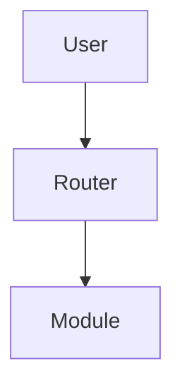

# WaddleBot Documentation Site

This directory contains the MkDocs-powered documentation site for WaddleBot, deployed to https://docs.waddlebot.io.

## Development

### Prerequisites
- Python 3.12+
- pip

### Local Development
```bash
# Install dependencies
pip install -r requirements.txt

# Start development server
mkdocs serve

# Build static site
mkdocs build
```

The documentation will be available at http://localhost:8000 with live reload.

## Structure

```
docs/
├── mkdocs.yml              # MkDocs configuration
├── requirements.txt        # Python dependencies
├── index.md               # Homepage
├── getting-started/       # Getting started guides
├── architecture/          # System architecture docs
├── core-modules/          # Core module documentation
├── interaction-modules/   # Interaction module docs
├── platforms/            # Platform integration guides
├── admin/                # Administration guides
├── sdk/                  # SDK and API documentation
└── .github/workflows/    # CI/CD for documentation
```

## Deployment

### Automatic Deployment
The documentation is automatically deployed to Cloudflare Pages when changes are pushed to the `main` branch in the `docs/` directory.

### Manual Deployment
```bash
# Build the site
mkdocs build

# Deploy to Cloudflare Pages
# (requires Cloudflare CLI configuration)
```

## Configuration

### MkDocs Configuration
The site is configured with:
- **Material Theme**: Modern, responsive design
- **Search**: Full-text search capability
- **Navigation**: Tabbed navigation with sections
- **Code Highlighting**: Syntax highlighting for code blocks
- **Mermaid Diagrams**: Architecture and flow diagrams

### Markdown Extensions
Enabled extensions:
- **Admonitions**: Info, warning, tip boxes
- **Code Blocks**: Syntax highlighting with copy button
- **Tables**: Enhanced table formatting
- **Emoji**: GitHub-style emoji support
- **Mermaid**: Diagram and flowchart support

## Content Guidelines

### Writing Style
- Use clear, concise language
- Include code examples where applicable
- Use admonitions for important notes
- Structure content with proper headings

### Code Examples
Use proper syntax highlighting:

```python
# Example Python code
def hello_world():
    return "Hello, WaddleBot!"
```

### Admonitions
Use these for special callouts:

```markdown
!!! tip "Pro Tip"
    This is helpful information for advanced users.

!!! warning "Important"
    This is something users need to be careful about.

!!! note "Additional Information"
    This provides extra context or details.
```

### Diagrams
Use Mermaid for system diagrams:

```markdown

```

## Contributing

1. Make changes to markdown files
2. Test locally with `mkdocs serve`
3. Commit changes to the `docs/` directory
4. Push to `main` branch for automatic deployment

## Links

- **Live Site**: https://docs.waddlebot.io
- **GitHub Repository**: https://github.com/WaddleBot/WaddleBot
- **Issue Tracker**: https://github.com/WaddleBot/WaddleBot/issues