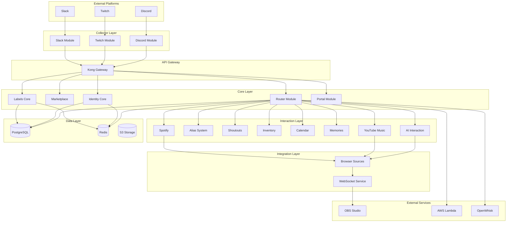

# System Architecture

WaddleBot is built with a modern microservices architecture designed for scalability, maintainability, and extensibility. This section provides an overview of the system's design principles and core components.

## Design Principles

### 🏗️ **Microservices Architecture**
Each component runs as an independent service with well-defined APIs:

- **Collector Modules**: Platform-specific message and event collection
- **Core Services**: Central business logic and data management
- **Interaction Modules**: Functional modules for specific features
- **Administration Tools**: Management and monitoring interfaces

### 🔄 **Event-Driven Communication**
Components communicate through:

- **REST APIs**: Kong API Gateway with unified routing
- **Message Events**: Platform events processed through router
- **WebSocket**: Real-time updates for browser sources
- **Database**: Shared state via PostgreSQL with read replicas

### 📈 **Horizontal Scalability**
Built for scale from day one:

- **Container-based**: Docker containers with Kubernetes orchestration
- **Database Scaling**: PostgreSQL with read replicas and connection pooling
- **Caching Layer**: Redis for session management and performance
- **Load Balancing**: Kong API Gateway with rate limiting

## System Overview

## Component Categories

### 🎯 **Core Components (Required)**
Essential services that must run for basic functionality:

| Component | Purpose | Port | Dependencies |
|-----------|---------|------|--------------|
| Router Module | Command routing and processing | 8000 | PostgreSQL, Redis |
| Marketplace | Module management | 8001 | PostgreSQL |
| Identity Core | User identity and authentication | 8050 | PostgreSQL, Redis, py4web Auth |
| Portal Module | Web-based administration | 8000 | PostgreSQL, Identity Core |

### 📡 **Collector Modules (Platform-specific)**
One collector per platform integration:

| Platform | Module | Port | Features |
|----------|--------|------|----------|
| Discord | discord_module | 8003 | py-cord, slash commands, events |
| Twitch | twitch_module | 8002 | EventSub webhooks, Helix API |
| Slack | slack_module | 8004 | Events API, slash commands |

### ⚙️ **Interaction Modules (Optional)**
Feature-specific modules that can be enabled per community:

| Module | Purpose | Dependencies |
|--------|---------|--------------|
| AI Interaction | Chat responses with AI providers | Ollama/OpenAI/MCP |
| Alias System | Linux-style command aliases | Router |
| Shoutouts | User shoutouts with clips | Twitch API |
| Inventory | Item tracking and management | Labels Core |
| Calendar | Event management with approval | Labels Core |
| Memories | Quote/URL/reminder system | Labels Core |
| YouTube Music | Music search and playback | YouTube API |
| Spotify | Music control and display | Spotify API |

### 🎨 **Supporting Services**
Additional services for advanced features:

| Service | Purpose | Used By |
|---------|---------|---------|
| Browser Sources | OBS overlay integration | Music modules, general responses |
| Labels Core | Community/user labeling | Inventory, Calendar, Memories |
| Kong Admin Broker | Kong user management | Portal, Administration |

## Data Flow

### Message Processing Flow

1. **Message Reception**: Platform sends webhook/event to collector
2. **Event Classification**: Determine message type (chat, subscription, etc.)
3. **Router Forwarding**: Send to router with entity context
4. **Session Creation**: Router generates session_id and caches entity mapping
5. **Command Processing**: 
   - Parse command prefix (`!` for containers, `#` for serverless)
   - Check permissions and rate limits
   - Route to appropriate execution engine
6. **Module Execution**: Execute interaction modules sequentially or in parallel
7. **Response Processing**: Collect responses and route to appropriate channels
8. **Browser Source Updates**: Send media/ticker data to OBS integration

### Identity Verification Flow

1. **Link Request**: User types `!identity link platform username`
2. **Verification Code**: System generates time-limited code
3. **Platform Delivery**: Code sent via whisper/DM through collector
4. **Code Verification**: User submits code via `!verify CODE`
5. **Identity Linking**: Confirmed link stored in identity database
6. **API Key Generation**: Optional user API keys for programmatic access

## Technology Stack

### **Backend Framework**
- **py4web**: Modern Python web framework for all modules
- **PostgreSQL**: Primary database with read replica support
- **Redis**: Caching and session management
- **Kong**: API Gateway for unified routing and authentication

### **Container Orchestration**
- **Docker**: Containerization for all services
- **Kubernetes**: Container orchestration and scaling
- **Horizontal Pod Autoscaling**: Automatic scaling based on load

### **External Integrations**
- **AWS Lambda**: Serverless execution for community modules
- **Apache OpenWhisk**: Open source serverless alternative
- **Platform APIs**: Native integration with Discord, Twitch, Slack APIs

### **Development Tools**
- **Python 3.12**: Modern Python with type hints
- **ThreadPoolExecutor**: Concurrent processing
- **WebSocket**: Real-time communication
- **OAuth 2.0**: Secure platform authentication

## Security Architecture

### **Authentication & Authorization**
- **Kong API Keys**: Per-service authentication
- **py4web Auth**: User session management
- **OAuth Integration**: Platform-specific authentication
- **RBAC**: Role-based access control per community

### **Data Protection**
- **Webhook Signature Verification**: HMAC-SHA256 for platform webhooks
- **Token Encryption**: Secure storage of OAuth tokens
- **Rate Limiting**: Per-user, per-command, per-entity limits
- **Session Management**: Redis-based session storage with TTL

### **Network Security**
- **TLS Termination**: HTTPS/TLS at ingress level
- **Non-root Containers**: Security-hardened container images
- **Read-only Filesystems**: Immutable container filesystems
- **Network Policies**: Kubernetes network segmentation

## Scalability Features

### **Horizontal Scaling**
- **Coordination System**: Dynamic assignment of servers/channels to containers
- **Load Distribution**: Automatic workload balancing across instances
- **Auto-scaling**: Kubernetes HPA based on CPU/memory usage

### **Performance Optimization**
- **Multi-threading**: ThreadPoolExecutor for concurrent operations
- **Database Optimization**: Read replicas and connection pooling
- **Caching Strategy**: Multi-level caching with Redis and in-memory caches
- **Batch Processing**: Process up to 100 events concurrently

### **Monitoring & Observability**
- **Health Checks**: Comprehensive health monitoring for all services
- **Metrics Collection**: Performance metrics and usage statistics
- **Logging**: Structured AAA (Authentication, Authorization, Auditing) logs
- **Alerting**: Proactive monitoring with automated alerting