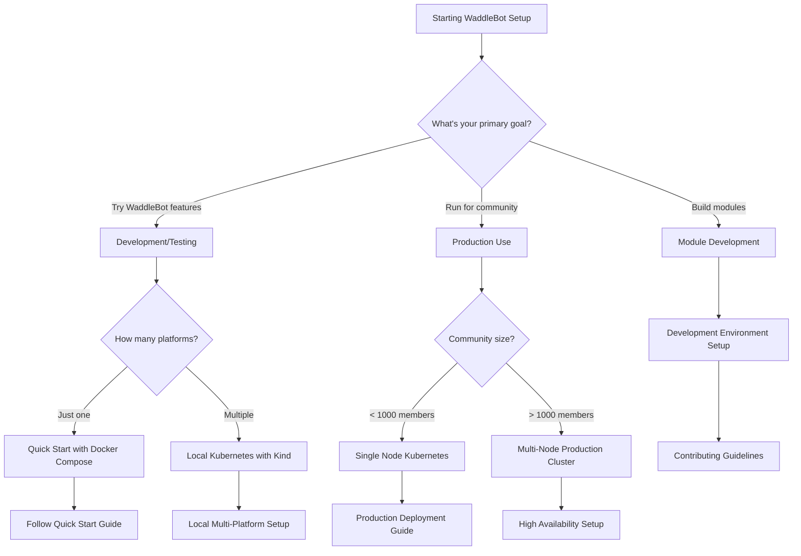

# Getting Started Overview

This section provides everything you need to get WaddleBot up and running in your environment. Whether you're setting up a development environment or deploying to production, we have guides to help you succeed.

## Choose Your Path

=== "🚀 Quick Start"
    Perfect for trying out WaddleBot quickly:
    
    - **Time**: 10-15 minutes
    - **Requirements**: Docker and Docker Compose
    - **Platforms**: Single platform (Discord, Twitch, or Slack)
    - **Use Case**: Development, testing, small communities
    
    **Next**: Follow our [Quick Start Guide](../USAGE.md)

=== "🏗️ Production Deployment"
    For production-ready deployments:
    
    - **Time**: 2-4 hours
    - **Requirements**: Kubernetes cluster, PostgreSQL, Redis
    - **Platforms**: Multi-platform support
    - **Use Case**: Large communities, high availability
    
    **Next**: Read the [Deployment Guide](../deployment-guide.md)

=== "🔧 Development Setup"
    For contributors and module developers:
    
    - **Time**: 30-60 minutes  
    - **Requirements**: Python 3.12, development tools
    - **Platforms**: Local development environment
    - **Use Case**: Contributing code, building modules
    
    **Next**: Check [Contributing Guidelines](../CONTRIBUTION.md)

## Prerequisites

### System Requirements

=== "Development"
    **Minimum Requirements:**
    - Python 3.12 or later
    - Docker and Docker Compose
    - 4GB RAM, 2 CPU cores
    - 10GB available disk space
    
    **Recommended:**
    - 8GB RAM, 4 CPU cores
    - SSD storage
    - Linux or macOS (Windows with WSL2)

=== "Production"
    **Minimum Requirements:**
    - Kubernetes cluster (3 nodes)
    - PostgreSQL 14+ with read replicas
    - Redis 6+ cluster
    - 16GB RAM total, 8 CPU cores
    - 100GB available storage
    
    **Recommended:**
    - High-availability Kubernetes setup
    - Managed PostgreSQL and Redis services
    - Load balancer with SSL termination
    - Monitoring and logging infrastructure

### Platform Prerequisites

Before setting up WaddleBot, you'll need to create applications on the platforms you want to integrate:

=== "Discord"
    **Required:**
    - Discord Developer Application
    - Bot token with appropriate permissions
    - Server with admin permissions for testing
    
    **Permissions Needed:**
    - Send Messages
    - Read Message History  
    - Use Slash Commands
    - Manage Roles (optional)
    
    **Setup Guide:** [Discord Platform Setup](../platforms/discord.md)

=== "Twitch"
    **Required:**
    - Twitch Developer Application
    - Client ID and Client Secret
    - EventSub webhook endpoint (HTTPS required)
    
    **Scopes Needed:**
    - `channel:read:subscriptions`
    - `bits:read`
    - `channel:read:redemptions`
    - `moderator:read:followers`
    
    **Setup Guide:** [Twitch Platform Setup](../platforms/twitch.md)

=== "Slack"
    **Required:**
    - Slack App in your workspace
    - Bot User OAuth Token
    - Event subscriptions endpoint
    
    **Permissions Needed:**
    - `chat:write`
    - `channels:read`
    - `users:read`
    - `reactions:write`
    
    **Setup Guide:** [Slack Platform Setup](../platforms/slack.md)

## Architecture Decision Tree

Use this flowchart to determine the best setup for your needs:

## Next Steps

### 1. Choose Your Setup Path
Based on your needs, pick the appropriate setup guide:

- **[Quick Start](../USAGE.md)**: Get running in 15 minutes with Docker
- **[Production Deployment](../deployment-guide.md)**: Full production setup
- **[Development Setup](../CONTRIBUTION.md)**: Environment for contributors

### 2. Platform Configuration
Set up your platform integrations:

- **[Discord Integration](../platforms/discord.md)**
- **[Twitch Integration](../platforms/twitch.md)**  
- **[Slack Integration](../platforms/slack.md)**

### 3. Core Configuration
Configure the core system components:

- **[Router Configuration](../core-modules/router.md)**
- **[Identity Management](../core-modules/identity.md)**
- **[Database Setup](../deployment-guide.md#database-configuration)**

### 4. Feature Modules
Enable the features your community needs:

- **[AI Chat Integration](../interaction-modules/ai.md)**
- **[Music Integration](../interaction-modules/youtube-music.md)**
- **[Community Management](../interaction-modules/inventory.md)**

### 5. Administration
Set up community management:

- **[Portal Access](../admin/portal.md)**
- **[User Management](../core-modules/identity.md)**
- **[Monitoring Setup](../logging-and-monitoring.md)**

## Common Setup Issues

!!! warning "HTTPS Requirement"
    Most platforms (especially Twitch) require HTTPS endpoints for webhooks. For development, consider using ngrok or similar tools to expose your local server.

!!! tip "Environment Variables"
    WaddleBot uses environment variables extensively. Consider using a `.env` file or secret management system to organize your configuration.

!!! note "Database Migrations"
    Each module manages its own database tables. Ensure your PostgreSQL user has CREATE TABLE permissions for automatic migrations.

## Getting Help

- **Discord/Twitch/Slack Issues**: Check platform-specific documentation
- **Setup Problems**: Review our [troubleshooting guide](../deployment-guide.md#troubleshooting)
- **Development Questions**: See [contributing guidelines](../CONTRIBUTION.md)
- **Bug Reports**: [GitHub Issues](https://github.com/WaddleBot/WaddleBot/issues)