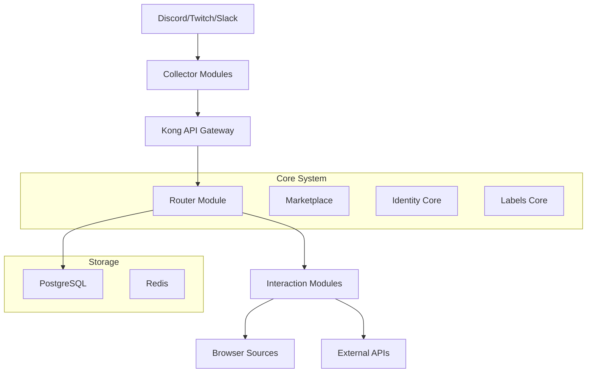

# WaddleBot Documentation

Welcome to the WaddleBot documentation! WaddleBot is a multi-platform chat bot system with a modular, microservices architecture designed for Discord, Twitch, and Slack communities.

## What is WaddleBot?

WaddleBot is a comprehensive chat bot framework built for scalability and extensibility. The system consists of:

- **Core Components**: Central API layer with routing, marketplace, and identity management
- **Collector Modules**: Platform-specific modules that receive webhooks/chat from platforms
- **Interaction Modules**: Modular functionality executed in containers or serverless functions
- **Administration Tools**: Community management portal and admin interfaces

## Key Features

### 🏗️ **Modular Architecture**
- Microservices-based design with independent, scalable components
- Docker containerization with Kubernetes orchestration
- Horizontal scaling with dynamic server/channel assignment

### 🌐 **Multi-Platform Support**
- **Discord**: Native py-cord integration with slash commands and events
- **Twitch**: EventSub webhooks with OAuth and Helix API integration
- **Slack**: Event API with slash commands and Socket Mode support

### ⚡ **High Performance**
- Multi-threaded command processing with ThreadPoolExecutor
- Redis caching and PostgreSQL with read replicas
- Kong API Gateway for unified routing and rate limiting

### 🔧 **Extensive Functionality**
- AI-powered interactions with multiple provider support (Ollama, OpenAI, MCP)
- Music integration (YouTube Music, Spotify) with OBS browser sources
- Community management tools (inventory, calendar, memories, labels)
- Cross-platform identity linking and verification

## Getting Started

=== "Quick Start"

    1. **Clone the repository**
       ```bash
       git clone https://github.com/WaddleBot/WaddleBot.git
       cd WaddleBot
       ```

    2. **Start with Docker Compose**
       ```bash
       docker-compose up -d
       ```

    3. **Configure your platforms**
       - Set up your Discord, Twitch, or Slack applications
       - Configure environment variables
       - Deploy collector modules

=== "Production Deployment"

    For production deployments, see our [Deployment Guide](deployment-guide.md) which covers:
    
    - Kubernetes deployment
    - Kong API Gateway configuration
    - PostgreSQL with read replicas
    - Redis cluster setup
    - SSL/TLS termination

## Architecture Overview



## Core Components

| Component | Description | Technology |
|-----------|-------------|------------|
| **Router Module** | High-performance command routing with caching | py4web, Python 3.12 |
| **Marketplace** | Community module marketplace and management | py4web, PostgreSQL |
| **Identity Core** | Cross-platform identity linking and verification | py4web Auth, Redis |
| **Labels Core** | Multi-threaded label management for communities | Python, ThreadPoolExecutor |
| **Portal Module** | Community management web interface | py4web, HTML/CSS |
| **Browser Sources** | OBS integration with WebSocket updates | WebSocket, HTML/JS |

## Why Choose WaddleBot?

### ✅ **For Community Managers**
- Unified management across Discord, Twitch, and Slack
- Rich web portal for community administration
- Comprehensive user identity and reputation system

### ✅ **For Developers**
- Modern Python stack with py4web framework
- Extensive API for custom module development
- Marketplace for sharing and monetizing modules

### ✅ **For Streamers**
- OBS browser source integration for overlays
- Music integration with YouTube and Spotify
- Automated shoutouts and community engagement

### ❌ **Not Right For You If**
- You need a simple, single-platform bot
- You prefer hosted solutions over self-hosting
- You don't need advanced community management features

## Quick Links

- [**Getting Started Guide**](getting-started/quick-start.md) - Step-by-step setup instructions
- [**API Documentation**](reference/api-reference.md) - Complete API reference
- [**Deployment Guide**](getting-started/deployment-guide.md) - Production deployment instructions
- [**Contributing**](getting-started/contributing.md) - How to contribute to the project

## Community & Support

- **GitHub**: [WaddleBot/WaddleBot](https://github.com/WaddleBot/WaddleBot)
- **Issues**: Report bugs and request features on GitHub
- **Documentation**: This site for comprehensive guides and API docs

---

!!! tip "Getting Help"
    New to WaddleBot? Start with our [Quick Start Guide](getting-started/quick-start.md) for step-by-step setup instructions.